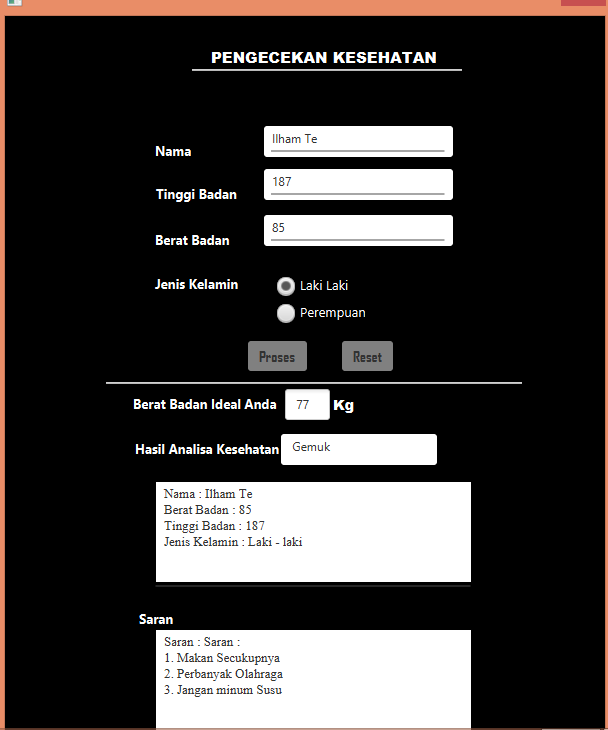
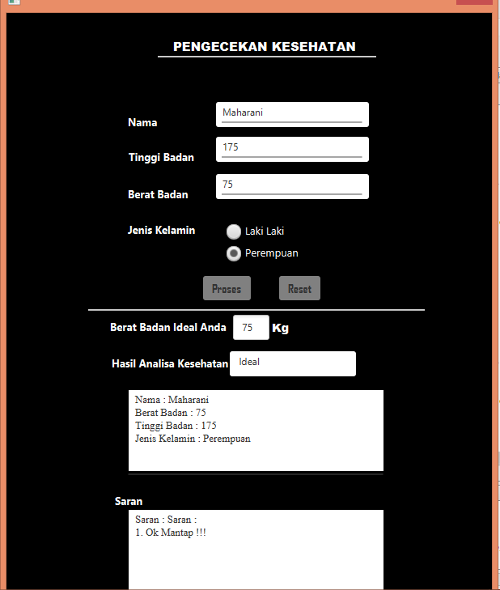
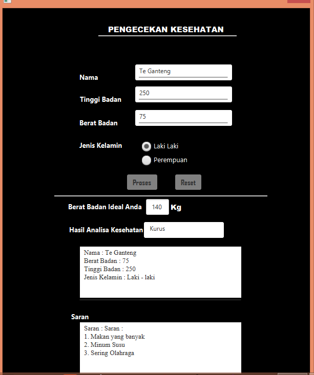

# JavaFxKesehatan

## Gambar pertama adalah output dari seseorang yang memiliki berat badan yang lebih alias gemuk(laki-laki).
#

## Gambar kedua adalah output dari seseorang yang memiliki berat badan yang normal(perempuan).
#

## Gambar ketiga adalah output dari seseorang yang memiliki berat badan yang kurang alias gemuk(laki-laki).

## NB : Untuk bagaimana perhitungan berat badan laki laki dan perempuan bisa dilihat di rumus yang ada didalam koding nya :))
# Terima Kasih Semoga Bermanfaat :)
